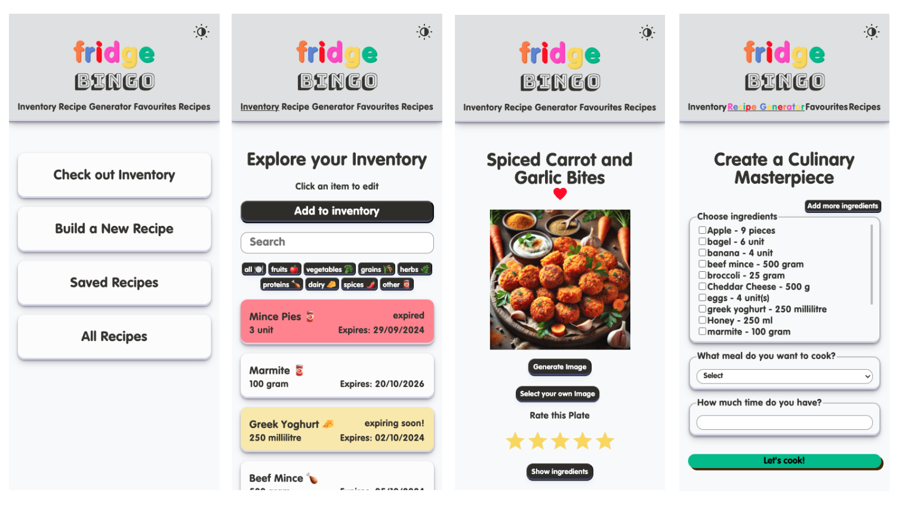
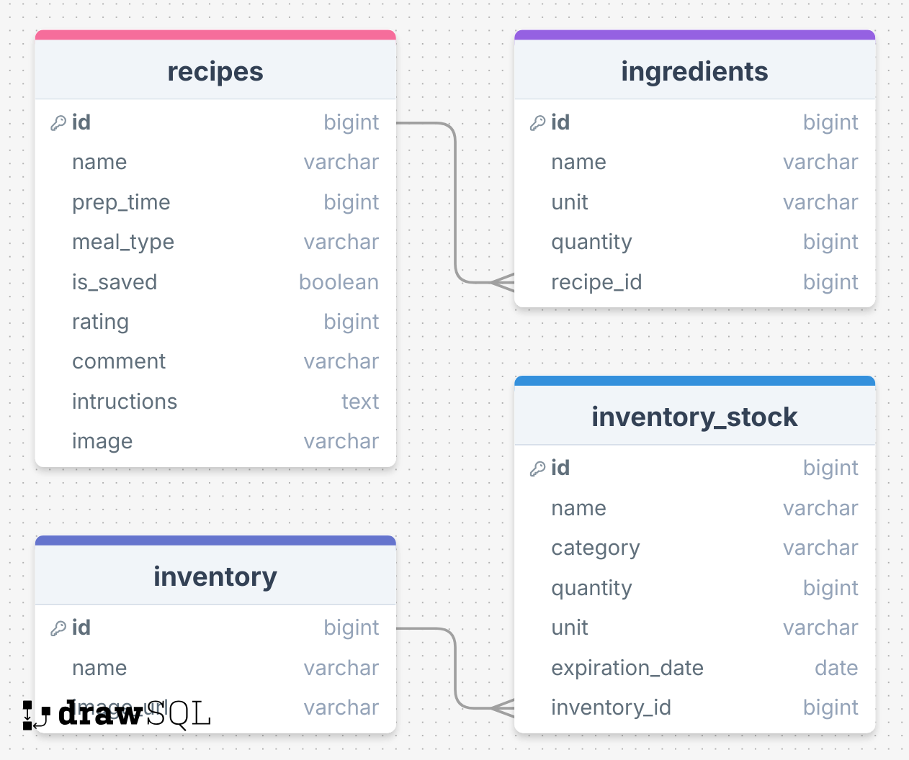

# Fridge Bingo

## Overview

Fridge Bingo encourages users to be resourceful and creative in the kitchen in a bid to combat food waste. The aim is to make cooking more accessible and fun by using random or leftover ingredients that they already have at home in order to create a delicious meal.

### Problem Space

As someone who likes to experiment with new recipes I find that I lack the imagination or knowledge of what I could do with the half-used vegetables, sauces, or ingredients leftover in my fridge that I would ideally like to save before they spoil and go to landfill.

In a busy world of convenience and cost saving having a simple tool to help utilise what ingredients you have available at home would be benefit those that want to live sustainably and do not have the time for frequent grocery shopping or detailed meal planning. Maximise what you have to minimise food waste!

### User Profile

- Home cooks
  - seeking inspiration for meal times
  - wanting to elevate their culinary skills
  - looking to avoid wasting time, money and food
  - that want to keep track of recipes they've tried

### Features

- As a user, I want to add the ingredients I have at home so that I have a virtual record of these to keep track of
- As a user, I want to be able to edit or remove items from my inventory
- As a user, I want to use the ingredients I have to receive recipe suggestions without having to buy additional groceries
- As a user, I want my inventory to be updated when I make a recipe so that my virtual record is accurate
- As a user, I want to receive step-by-step instructions so that I can easily follow the recipe
- As a user, I want to be able to save a recipe that has been generated so that I can revisit it in future or share it with friends

- As a user, I want to be able to see my previous/saved recipes
- As a user, I want to be able to rate a recipe out of 5 stars
- As a user, I want to be able to filter/sort my recipes by rating
- As a user, I want to be able to upload a comment or photo to the recipe

## Implementation

### Tech Stack

- JavaScript
- React
- Node
- Express
- mySQL
- Client libraries:
  - react
  - react-router
  - axios
  - modal
  - react-simple-star-rating
  - sass
- Server libraries:
  - knex
  - dotenv
  - cors
  - multer

### External APIs

- ChefGPT
  - to generate recipes from an available set of ingredients
- OpenAI
  - to generate images of recipes

### Sitemap

- Dashboard

  - The main landing page that provides a link to view inventory, generate a new recipe and view recent/saved suggestions.

- Inventory

  - A virtual record of fridge/cupboard contents with the ability to manually add, remove or update ingredients.

- Recipe Generator

  - A page that generates ideas based on the user's available ingredients. User enters the ingredients they want to use up and a recipe is returned.

- Favourites

  - A page with a record of a users saved recipes.

- Recipes

  - A page with a record of all the recipes a user has generated.

- Individual Recipe Page

  - A page containing the details for a recipe, with step-by-step instructions, required ingredients and the ability to upload or generate an image of the dish.

### Mockups



### Data



### Endpoints

Both external APIs used in this project require subscriptions. If you are a verified subscriber enter the API keys in the .env file on the server.

[The Server Repo can be found here ](https://github.com/katieglennon/fridge-bingo-server)

**GET /api/recipes**

Full list of recipes, returns all recipes stored on DB

Response:

Array of all recipe objects

```
- [{...}, {...}, {

  - id: random recipe id,
  - name: Recipe Name,
  - prep_time: Time in minutes,
  - meal_type: Type of meal,
  - is_saved: boolean,
  - rating: integer (1-5),
  - comment: string,
  - instructions: [string, string string]
  - created_at: timestamp
  - updated_at: timestamp
  - image: string

  }]
```

---

**GET /api/recipes/saved**

Fetches a list of recipes the user has saved, returns all recipes stored on DB with a saved status

Response:

Array of recipe objects

---

**GET /api/recipes/:id**

Full recipe object

Response:

Full recipe object for individual recipe, specified by ID

---

**POST /api/recipes/new**

Generates recipe suggestions based on the user's available ingredients. Using ChefGPT 'recipe-from-ingredients' endpoint and storing results in DB, whilst simultaneously updating quantity from inventory_stock table.

- Requires req body:
  - Object containing:
    - ingredients: An array of strings representing ingredients (with quantity and measurement unit)
    - mealType: The type of meal you want to create ['breakfast', 'lunch', 'dinner', 'snack', 'dessert']
    - preparationTime: in minutes

Response:

Full recipe object, specified by ID and recipe ingredients used

---

**PATCH /api/recipes/:id/save**

Update saved status of an individual recipe

- Requires req body:
  - Object containing:
    - is_saved: boolean

Response:

Full recipe object, specified by ID and success message

---

**PATCH /api/recipes/:id/rate**

Update individual recipe rating

- Requires req body:
  - Object containing:
    - rating: integer

Response:

Full recipe object, specified by ID and success message

---

**PATCH /api/recipes/:id/image/upload**

Add image from local storage

- Requires req.file containing image

Response:

Full updated recipe object, specified by ID and success message

---

**PATCH /api/recipes/:id/image/generate**

Generate an AI image of the recipe

- Requires req.body containing:
  - image prompt (e.g. dish title and ingredients included)

Response:

Full updated recipe object, specified by ID and success message

---

**GET /api/inventory**

Fetches the user's current fridge/cupboard contents.

Response:

Array of all food objects

```
- [{...}, {...}, {

  - id: random stock item id,
  - name: Ingredient Name,
  - category: Food type,
  - unit: Unit of measurement,
  - quantity: integer,
  - expiration_date: date,
  - created_at: timestamp
  - updated_at: timestamp
  - inventory_id: foreign key to inventory table

  }]
```

---

**GET /api/inventory/id**

Full inventory item object

Response:

Full object for individual inventory stock item, specified by ID

---

**POST /api/inventory**

Adds ingredients in the fridge/cupboard inventory.

- Requires req body:
  - Object containing stock item:
    - name: string
    - category: string
    - unit: string
    - quantity: integer
    - expiration_date: date

Response

Full object for individual inventory stock item, specified by ID

---

**PATCH /api/inventory**

Updates ingredients in the fridge/cupboard inventory.

- Requires req body:
  - Object containing stock item:
    - name: string
    - category: string
    - unit: string
    - quantity: integer
    - expiration_date: date

Response

Full object for updated inventory stock item, specified by ID

---

**DELETE /api/inventory**

Deletes an ingredient from the inventory (e.g. if added in error)

Response (empty) with 204 status code

## Roadmap

- Create client
- Create server
- Create database
- Experiment with ChefGPT API, gather example recipes
- Feature: Add ingredient
  - Create POST /inventory endpoint
  - Implement post ingredient form including validation
- Feature: Inventory
  - Create GET /inventory endpoint
  - Implement view inventory page
- Feature: Edit/delete ingredients
  - Create PATCH/DELETE /inventory endpoint
- Feature: Recipe generator
  - Create form to build meal
  - Send request to ChefGPT API
- Feature: Recipe step by step
  - Implement view recipe page
- Feature: Saved recipes
  - Create GET /recipes endpoint
  - Implement view saved recipes page
- Feature: Rate recipe
  - Create POST /recipe endpoint to add rating

---

## Future Implementations

- User login

  - This will be hardcoded initially so future work to add the ability to register a user account and login a user.

- Expiration Alerts

  - A notification page that shows ingredients that are about to expire, encouraging users to use them before they go to waste.

- Leftover Reinvention

  - Input cooked food leftovers and get suggestions for how to transform it into a new dish, to avoid eating the same meal twice.

- Food Waste Tracking and Statistics

  - Track how much food waste that's avoided being wasted by using fridge ingredients to measure my environmental impact.

- 'Shelfie':

  - Scanning of ingredients including expiration dates. Take a picture of what is in your fridge or cupboards so you don't buy a double of something you've already got. Potential for AI integration to update inventory stock from image.

- Rate my Plate

  - A blog style/social media page where saved recipes can be accessed, with ability to share to other users for feedback.
