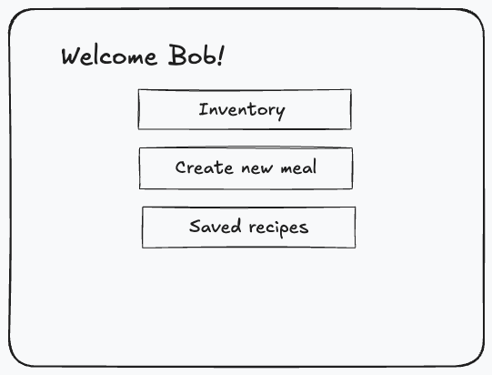
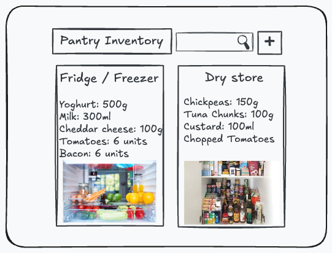
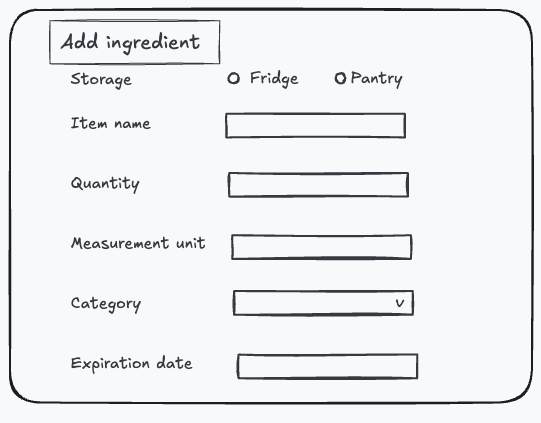
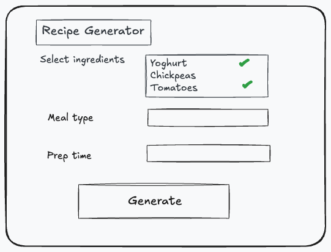
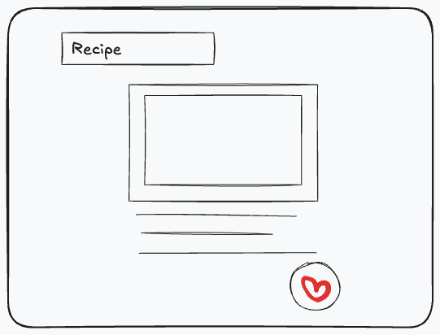
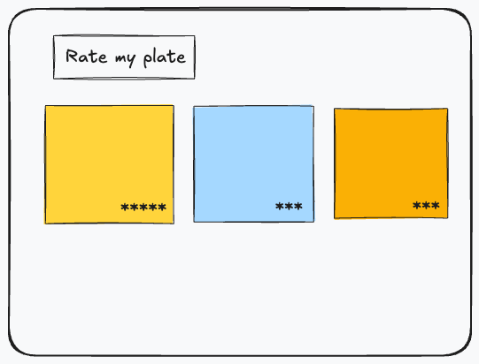
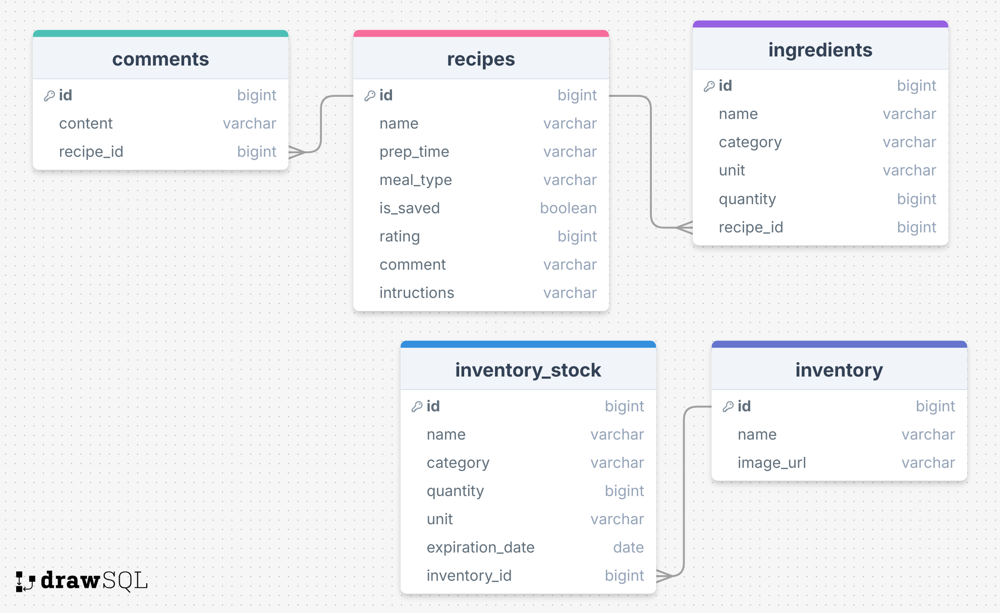

# Fridge Bingo

## Overview

Fridge Bingo encourages users to be resourceful and creative in the kitchen in a bid to combat food waste. The aim make cooking more accessible and fun by using random or leftover ingredients that they already have at home in order to create a delicious meal.

### Problem Space

I like to experiment with new recipes but I lack the imagination or knowledge of what I could do with the half-used vegetables, sauces, or ingredients leftover in my fridge that I would ideally like to save before they spoil and go to landfill.

In a busy world of convenience and cost saving having a simple tool to help utilise what ingredients you have available at home would be benefit those that want to live sustainably and do not have the time for frequent grocery shopping or detailed meal planning. Maximise what you have to minimise food waste!

### User Profile

- Home cooks
  - seeking inspiration for meal times
  - wanting to elevate their culinary skills
  - looking to avoid wasting time, money and food
  - that want to keep track of recipes they've tried

### Features

- As a user, I want to be able to create an account to manage my recipes
- As a user, I want to be able to login to my account to manage my recipes

- As a user, I want to input the ingredients I have in my fridge, so that I can receive recipe suggestions without having to buy additional groceries
- As a user, I want to receive step-by-step instructions so that I can easily follow the recipe
- As a user, I want to be able to save a recipe that has been generated so that I can revisit it in future or share it with friends

- As a user, I want to be able to see my previous/saved recipes
- As a user, I want to be able to rate an attempted recipe out of 5 stars
- As a user, I want to be able to filter/sort my recipes by rating
- As a user, I want to be able to upload a comment or photo to the recipe

## Implementation

### Tech Stack

- React
- JavaScript
- mySQL
- Express
- Client libraries:
  - react
  - react-router
  - axios
- Server libraries:
  - knex
  - express

### Sitemap

- Dashboard

  - The main landing page that provides a link to generate a new recipe and view recent/saved suggestions. Possibly include an overview of the user's fridge/cupboard contents.

- Recipe Suggestions

  - A page that generates ideas based on the user's available ingredients. User enters the ingredients they want to use up and a recipe is returned.

- Rate my Plate

  - A blog style page where saved recipes can be accessed, with potential to share to other users for feedback.

- Fridge Inventory: "Shelfie"

  - A virtual record of fridge/cupboard contents with the ability to manually add, remove or update ingredients. Take a picture of what is in your fridge or cupboards so you don't buy a double of something you've already got.

### Mockups

#### Dashboard



#### Inventory overview



#### Add ingredient



#### Generate recipe



#### Recipe details



#### Saved recipes



### Data



### APIs

ChefGPT (https://api.chefgpt.xyz/)
**POST /api/generate/recipe-from-ingredients**

- Generates recipe suggestions based on the user's available ingredients. Using ChefGPT 'recipe-from-ingredients' endpoint or their widget. In the same function save the recipe to my db.

Parameters:

- ingredients
- meal type
- measurement system (imperial/metric)

Response:

```
{
  "recipeName": "Delicious Chicken and Rice",
  "ingredients": [
    {
      "name": "Chicken",
      "unit": "grams",
      "amount": 500
    },
    {
      "name": "Rice",
      "unit": "cups",
      "amount": 2
    },
    // ... other ingredients
  ],
  "instructions": [
    "1. Preheat the oven to 350°F.",
    "2. Season the chicken with salt and pepper.",
    // ... other instructions
  ],
  "difficulty": "intermediate",
  "macros": {
    "carbs": {
      "amount": 40,
      "unit": "grams"
    },
    // ... other macros
  },
  "preparationTime": 30,
  "servings": 2,
  "kitchenToolsUsed": ["oven", "pot"]
}
```

### Endpoints

**GET /api/recipes/saved**

- Fetches a list of recipes the user has saved.

Parameters:

- user_id

Response:

```
[
     {
        "user_id": "1234",
        "recipe_id": "1213",
        "recipe_name": "Chicken and Rice"
        "rating": 4.5,
        "user_comments": "Great dish, will try again!"
        "is_saved": "true"
     },
     { ... }
]

```

**POST /api/recipes/:id/rate**

- Enables users to rank recipes using a star system or like/comment on a saved recipe.

Parameters:

- user_id
- recipe_id
- rating
- comments

Response:

```
{
  "user_id": "1234",
  "recipe_id": "1213",
  "rating": 4.5,
  "comments": "Great dish, will try again!"
}

```

**POST /api/fridge/shelfie**

- Enables user to upload a picture of their fridge or cupboard contents.

Parameters:

- user_id
- image

```
{
  "user_id": "1234",
  "inventory_id": "1",
  "image_url": ...
}
```

**GET /api/fridge/inventory**

- Fetches the user's current fridge/cupboard contents.

Parameters:

- user_id

Response

```
[
   { "ingredient": "", "quantity": "", "expiration": "" },
   { "ingredient": "", "quantity": "", "expiration": "" },
   { "ingredient": "", "quantity": "", "expiration": "" },
   { ... }
]
```

**POST /api/fridge/inventory**

- Adds ingredients in the fridge/cupboard inventory.

Parameters:

- user_id
- ingredients

Response

```
  { "ingredient": "", "quantity": "", "expiration": "" }
```

**PATCH/PUT /api/fridge/inventory**

- Updates ingredients in the fridge/cupboard inventory.

Parameters:

- user_id
- inventory_stock_id

Response

```
  { "ingredient": "", "quantity": "", "expiration": "" }
```

**DELETE /api/fridge/inventory**

- Deletes an ingredient from the inventory (e.g. if added in error)

Parameters:

- user_id
- inventory_stock_id

Response (empty) with 204 status code

## Roadmap

- Create client
- Create server
- Create database
- Experiment with ChefGPT API, gather example recipes
- Feature: Add ingredient
  - Create POST /inventory endpoint
  - Implement post ingredient form including validation
- Feature: Inventory
  - Create GET /inventory endpoint
  - Implement view inventory page
- Feature: Edit/delete ingredients
  - Create PUT/PATCH/DELETE /inventory endpoint
- Feature: Recipe generator
  - Create form to build meal
  - Send request to ChefGPT API
- Feature: Recipe step by step
  - Implement view recipe page
- Feature: Saved recipes
  - Create GET /recipes endpoint
  - Implement view saved recipes page
- Feature: Rate recipe
  - Create POST /recipe endpoint to add rating

---

## Future Implementations

- User login

  - This will be hardcoded initially so future work to add a user account and login a user.

- Expiration Alerts

  - A notification pag e that shows ingredients that are about to expire, encouraging users to use them before they go to waste.

- Leftover Reinvention

  - Input cooked food leftovers and get suggestions for how to transform it into a new dish, to avoid eating the same meal twice.

- Food Waste Tracking and Statistics

  - Track how much food waste that's avoided being wasted by using fridge ingredients to measure my environmental impact.

- 'Shelfie' v2:

  - Scanning of ingredients including expiration dates.

- Generate API image of meal
  - User clicks a button to make second API call
